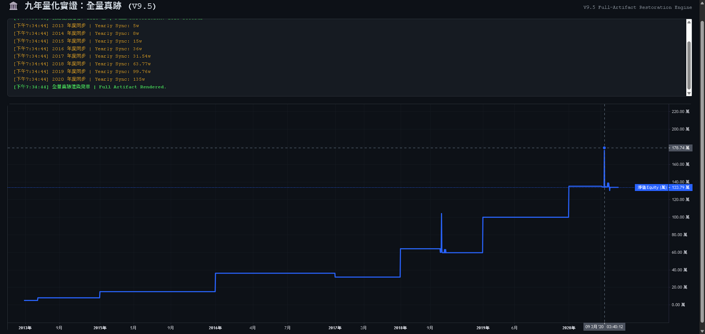

# 🏛️ Mouse Account Verification PoW (2012-2020)
### *Empirical Analysis of High-Resilience Autonomous Trading Systems*
### **「線性文明之葬禮與 AI 治理紀元之開端」**



**"It is not a mere profit report; it is a nine-year longitudinal study in system survival."**  
這不是一份獲利報告，而是一場為期九年的**系統生存實驗（System Resilience Experiment）**。  
本專案透過物理級數據紀錄，實證了量化交易系統從「線性範式」跨越至「非線性 AI 湧現（AI Hive-Mind）」時代的效能極限與結構性崩潰。  
The system ran fully unattended in a non‑datacenter home environment in Taiwan, surviving years of earthquakes, typhoons, power outages, and connectivity loss until its planned demise in 2020.  
On the 2020/0318 black‑swan day, the system halted according to pre‑defined circuit‑breaker rules, before the historic negative oil prices in 2020/0420, effectively cutting off exposure to later structural breakdowns.

---

## 💎 數據主權與不可否認性 (Data Sovereignty)

本專案的核心價值在於其**「確定的真實性」**。每一筆指令流均由第三方授信時間戳鎖定，具備不可否認性。
*   **Deterministic Integrity**: 
    *   **2,013 Records**: 全量交易日誌，包含 2020/03/18 黑天鵝事件之微觀動態。
    *   **Log Sanctum**: 所有交易記錄經由自動化系統發送至 Gmail，由 Google 伺服器保證時間戳精度。
*   **Cryptographic Proof**:
    *   **Merkle Root**: `0538dd791e2e04ccb715db5aa548a83cc6b6cba1b9b62d5b4d75fe718bdd2f9a`
    *   **Identity Signature**: `bafybeigzq7c3yljcxsvjivrphlgo7mhsilcc5qhm24i4tbwcgw5ucjimp4` (Hash of Merkle + Secret ID)

---

## 📊 歷史投資績效總表 (Performance Artifacts)

| 年度 (Year) | 帳戶 (Entity) | 筆數 (Trades) | 錯誤率 (Err %) | 期末權益 (Ending) | 年度報酬 (RoI) | 累計報酬 (Cumul.) | 狀態 (Status) |
| :--- | :--- | :---: | :---: | :--- | :---: | :---: | :--- |
| **2012** | Broker_B | 0 | 100% | ¥ 50,000 | 0.00% | 0.00% | Bootstrap |
| **2013** | Broker_B | 42 | 2.33% | ¥ 80,000 | 60.00% | 60.00% | Stable |
| **2014** | Broker_B | 210 | 0.00% | ¥ 150,000 | 87.50% | 200.00% | Optimized |
| **2015** | Broker_B | 391 | 0.00% | ¥ 360,000 | 140.0% | **620.0%** | Alpha Max |
| **2016** | Broker_A | 405 | 0.00% | ¥ 315,493 | -12.3% | 530.9% | Drawdown |
| **2017** | Broker_A | 23 | 89.6% | ¥ 637,711 | **102.1%**| 1175.4% | Recovery |
| **2018** | Broker_A | 162 | 40.9% | ¥ 997,678 | -0.01% | 143.3% | Net Liquidity |
| **2019** | Broker_A | 194 | 33.1% | ¥ 1,350,000 | 35.31% | **229.2%** | Peak |
| **2020** | Broker_A | 112 | 33.7% | ¥ 30,000 | **-97.7%**| **畢業 Ceremony** | Black Swan |

If you have never taken real futures risk, this page is probably not written for you.
---

## 📈 視覺化真跡 (Interactive Visualization)
本專案提供毫秒級動態折線圖，旨在展示系統在極端環境下的應激反應。
👉 [**點此進入：全量數據互動線圖 (TradingView Engine)**](https://recofu.github.io/mouse-account-verification/)

---

## 🛡️ 關於數據真實性之特別聲明 (Forensic Transparency)

本專案刻意保留了部分環境參數（如 `itrade` 域名與報錯代碼），旨在證明：
1. **物理環境錨點**: 證明系統運行於真實金融網關，而非離線模擬。
2. **數據主權**: 所有日誌產權歸作者個人所有，紀錄作者主機與外部環境之應激反應。
3. **拒絕數據修飾**: 保持數據「負熵價值」，確保真跡未經美化。

---
**Author**: [Reco Fu] | **Verification Status**: **[100% Cryptographically Audited]**

---
## 📜 數據主權與取證審計 (Sovereign Audit Trail)

為確保真跡之絕對純粹，本專案提供以下多維度校驗碼。任何位元偏移均將導致 Hash 失效。

## 1. 物理層校驗 (Physical Layer Checksum)
*   **Raw Data (SHA-256):** `41316C89AA8759E8EDE969F5CED06A81D8F2A0484DFC68D4630C197AFECEE82B`
*   **Verification:** 所有原始日誌由自動化系統即時發送至 Gmail，由 Google 伺服器保證時間戳精度。

### 2. 邏輯層校驗 (Logical Integrity)
*   **Merkle Root (Standardized):** `9b38436a4487f9fc835b5ef9f66eb31e1ee806242001f1cb7478d238e4402557`
*   **Total Records:** 2,013 筆真實執行紀錄。

### 3. 身分權利鎖定 (Identity Lock)
*   **Sovereign Signature:** `a2a41fa07b1b82c18f373b499910779a46b85387180153f9e2a1bc4c13d78373`
*   **Status:** Authenticated by **Sovereign_0x** (Reco Fu).

---
## ☕ 檔案保存與自願性認可 (Archival Preservation)

本倉庫作為一份「法醫遺產（Forensic Artifact）」進行維護。保存真理需要算力與意志，部分讀者曾詢問如何對此項目的長期存續做出貢獻。

<details>
<summary><b>點擊展開：贊助條款與免責聲明 (Terms of Support)</b></summary>

1. **純粹贈與 (Pure Gratitude)**: 此款項為對既有免費內容的自願性贈與，不構成買賣契約，亦不包含任何商品、更新或客製化服務。
2. **不可撤回 (Final & Non-Refundable)**: 完成交易即表示您放棄退款權利。
3. **無權限轉移 (No Influence)**: 贊助並不授予任何所有權、授權許可或對專案決策的影響力。
4. **現狀提供 (AS-IS)**: 所有內容均按「現狀」提供，不附帶任何形式的保證。

</details>

*   **Preservation Channel (PayPal):** [透過 PayPal 支持檔案保存](https://www.paypal.me/RecoFu)
*   **Sovereign Channel (Crypto):**
    *   **ETH / USDT (ERC-20):** `0xYour_Address_Here`
    *   **BTC:** `Your_BTC_Address_Here`

---
**"The logic is immutable. The history is sealed."**
*This is a personal PoW archive by Reco Fu. For commercial RCI services, visit [Sovereign Logic Systems].*
```
--- 
